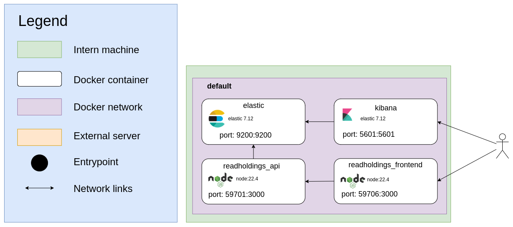

# readholdings

Readholdings is a service providing a global view of several accounts used by EbscoHost's HLM tool. The data is saved in an elasticsearch index and can be viewed on kibana dashboards. This application need API key from [ebsco API](https://developer.ebsco.com/knowledge-services/docs/holdingsiq-overview).

**Table of content**
- [Description](#Description)
- [Network-flow](#Network-flow)
- [Installation](#Installation)
    - [Development](#Development)
        - [Prerequisites](#Prerequisites)
        - [Start](#Start)
        - [Tests](#Tests)
    - [Deployment](#Deployment)
      - [Prerequisites](#Prerequisites)
- [Data update](#Data-update)

## Description

A web interface is used to communicate with an API. It is possible to insert data, track insertions, manage ElasticSearch indexes and manage the application's health status.

Data updates are automated using an application cron job. This launches a job that generates, downloads, reads and transforms the data, then inserts it into the snapshot generated by the [Ebsco API in version 2](https://developer.ebsco.com/knowledge-services/reference/getcustidexports).

## Network-flow

readHoldings is made up of several services which are distributed in several docker containers.


## Data format

There are 4 types of field : 
- id: the id is a concatenation of Portal, VendorID, PackageID, KBID, seperated by "_"
- standard from standard export from Ebsco API
- kbart2 from kbart2 export from Ebsco API
- meta which are custom fields created when data is inserted into elastic
    - access_type: If the holding (KBID) is in [DOAJ](https://doaj.org/apply/guide/#basic-criteria-for-inclusion) or DOAB, it will be 'F' (Free); otherwise, it will be 'P' (Paying).
    - BibCNRS: Indicate which CNRS portal this data belongs to
    - createdAt: Date the data was inserted in elastic
    - EmbargoMonth: Unify EmbargoMonth from different time units in month
    - CustomEmbargoMonth: Unify CustomEmbargoMonth from different time units in month
    - ManagedCoverageBegin: Transform the array into a string, replacing 'Present' with the 31st of December of the current year and 'No Access' with '0001-01-01'
    - ManagedCoverageEnd: Transform the array into a string, replacing 'Present' with the 31st of December of the current year and 'No Access' with '0001-01-01'
    - CustomCoverageBegin: Transform the array into a string, replacing 'Present' with the 31st of December of the current year and 'No Access' with '0001-01-01'
    - CustomCoverageEnd: Transform the array into a string, replacing 'Present' with the 31st of December of the current year and 'No Access' with '0001-01-01'
    - holdingID: Concatenation of standard.VendorID, standard.PackageID, standard.KBID, kbart2.date_first_issue_online, kbart2.date_last_issue_online, kbart2.embargo_info, separated by "_"
    - INSU: Presence of holdingID in another portal
    - INSMI: Presence of holdingID in another portal
    - INSHS: Presence of holdingID in another portal
    - INS2I: Presence of holdingID in another portal
    - INC: Presence of holdingID in another portal
    - INEE: Presence of holdingID in another portal
    - INSIS: Presence of holdingID in another portal
    - INP: Presence of holdingID in another portal
    - IN2P3: Presence of holdingID in another portal
    - INTEST: Presence of holdingID in another portal

## Kibana config

- XPACK_REPORTING_MAXCONCURRENTEXPORTS=5
- XPACK_REPORTING_CSV_MAXSIZEBYTES=3221225472
- XPACK_REPORTING_QUEUE_TIMEOUT=1800000
- ELASTICSEARCH_SETTING_kibana.autocompleteTimeout=300000

## Installation

### Development

#### Prerequisites

The tools you need to let readholdings run are :
* docker
* npm

#### Commands 

```bash
# install dependencies
npm i

# Execute this one time
docker compose -f docker-compose-dev.yml run --rm elastic chown -R elasticsearch /usr/share/elasticsearch/ 

# Start ReadHoldings as daemon
docker compose -f docker-compose-dev.yml up -d

# Stop ReadHoldings
docker compose -f docker-compose-dev.yml stop

# Get the status of ReadHoldings services
docker compose -f docker-compose-dev.yml ps
```

### Deployment

#### Prerequisites

* docker
* Total extracted data does not exceed 500 000 rows

#### Environment variables

You can create an environment file named `readholdings.local.env.sh` and export the following environment variables. You can then source `readholdings.env.sh`, which contains a set of predefined variables and is overridden by `readholdings.local.env.sh`.

#### Adjust system configuration for Elasticsearch

Elasticsearch has some [system requirements](https://www.elastic.co/guide/en/elasticsearch/reference/current/system-config.html) that you should check.

To avoid memory exceptions, you may have to increase mmaps count. Edit `/etc/sysctl.conf` and add the following line :

```ini
# configuration needed for elastic search
vm.max_map_count=262144
```
Then apply the changes : 
```bash
sysctl -p
```
#### Start/Stop/Status

Before you start readholdings, make sure all necessary environment variables are set.

```bash
# Start readholdings as daemon
docker-compose up -d

# Stop readholdings
docker-compose stop

# Get the status of readholdings services
docker-compose ps
```

#### Tests

No test are available (coming soon).
