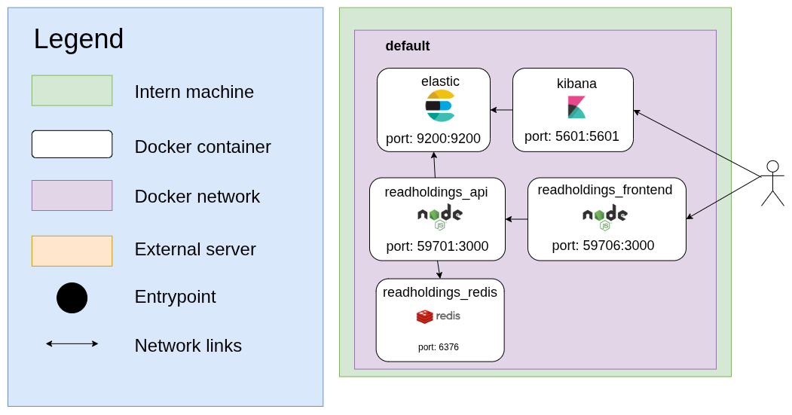

# readholdings

Readholdings is a service providing a global view of several accounts used by EbscoHost's HLM tool. The data is saved in an elasticsearch index and can be viewed on kibana dashboards.

**Table of content**
- [Description](#Description)
- [Network-flow](#Network-flow)
- [Installation](#Installation)
    - [Development](#Development)
        - [Prerequisites](#Prerequisites)
        - [Start](#Start)
        - [Tests](#Tests)
    - [Deployment](#Deployment)
      - [Prerequisites](#Prerequisites)
- [Data update](#Data-update)

## Description

HLM data must be downloaded manually by the user and inserted into readholdings app.

A web interface is used to communicate with an API. It is possible to insert data, track insertions, manage ElasticSearch indexes and manage the application's health status.

## Network-flow

readHoldings is made up of several services which are distributed in several docker containers.


## Installation

### Development

#### Prerequisites

The tools you need to let readholdings run are :
* docker
* npm

#### Commands 

```bash
# install dependencies
npm i

# Execute this one time
docker-compose -f docker-compose.debug.yml run --rm elastic chown -R elasticsearch /usr/share/elasticsearch/ 

# Start ReadHoldings as daemon
docker-compose -f docker-compose.debug.yml up -d

# Stop ReadHoldings
docker-compose -f docker-compose.debug.yml stop

# Get the status of ReadHoldings services
docker-compose -f docker-compose.debug.yml ps
```

#### Tests

No test are available (coming soon).

### Deployment

#### Prerequisites

* docker
* Total extracted data does not exceed 500 000 rows

#### Environment variables

You can create an environment file named `readholdings.local.env.sh` and export the following environment variables. You can then source `readholdings.env.sh`, which contains a set of predefined variables and is overridden by `readholdings.local.env.sh`.

### Adjust system configuration for Elasticsearch

Elasticsearch has some [system requirements](https://www.elastic.co/guide/en/elasticsearch/reference/current/system-config.html) that you should check.

To avoid memory exceptions, you may have to increase mmaps count. Edit `/etc/sysctl.conf` and add the following line :

```ini
# configuration needed for elastic search
vm.max_map_count=262144
```
Then apply the changes : 
```bash
sysctl -p
```
### Start/Stop/Status

Before you start readholdings, make sure all necessary environment variables are set.

```bash
# Start readholdings as daemon
docker-compose up -d

# Stop readholdings
docker-compose stop

# Get the status of readholdings services
docker-compose ps